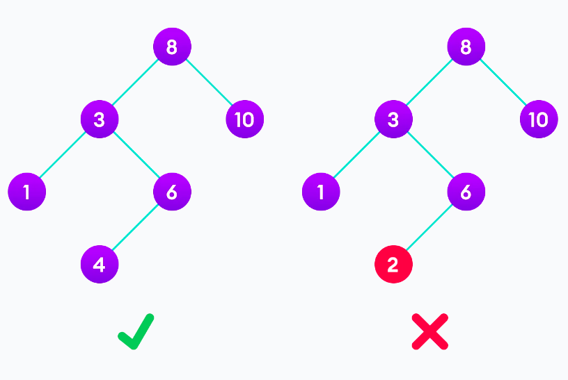
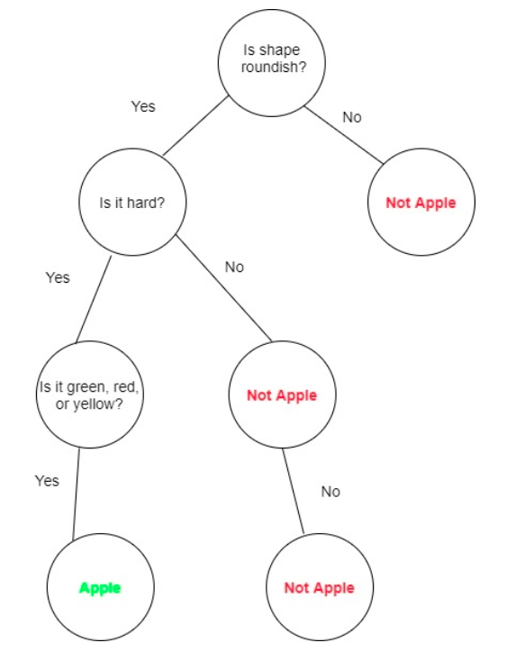

# Binary Search Tree (BST)

- Binary search tree is a data structure that quickly allows us to maintain a sorted list of numbers.

- It is called a binary tree because each tree node has a maximum of two children.

- It is called a search tree because it can be used to search for the presence of a number in O(log(n)) time.

- The properties that separate a binary search tree from a regular binary tree is

    - All nodes of left subtree are less than the root node
    - All nodes of right subtree are more than the root node
    - Both subtrees of each node are also BSTs i.e. they have the above two properties



---------------------------------------------------

# Time Complexity

| Operation	| Best Case | Average Case | Worst Case |
|-----------|-----------|--------------|------------|
|Search  	| Ω(log n)  |	Θ(log n)   |    O(n)    |
|Insertion	| Ω(log n)  |	Θ(log n)   |    O(n)    |
|Deletion	| Ω(log n)  |	Θ(log n)   |    O(n)    |

---------------------------------------------------

# Applications of BST

BSTs are mainly used for searching and sorting as they provide a means to store data hierarchically. 


- **Sorting :**
    - It is helpful in maintaining a sorted stream of data.

- **Searching :**
    - They are helpful to implement various searching algorithms.

- **Expression Evaluation :**

    - Another useful application of binary trees is in expression evaluation. In mathematics, expressions are statements with operators and operands that evaluate a value. The leaves of the binary tree are the operands while the internal nodes are the operators.

- **Indices for Databases :**
    - In database indexing, B-trees are used to sort data for simplified searching, insertion, and deletion. It is important to note that a B-tree is not a binary tree, but can become one when it takes on the properties of a binary tree.

    - The database creates indices for each given record in the database. The B-tree then stores in its internal nodes, references to data records with the actual data records in its leaf nodes. This provides sequential access to data in the databases.

- **Routing Tables :**
    - A routing table is used to link routers in a network. It is usually implemented with a tree data structure, which is a variation of a binary tree. The tree data structure will store the location of routers based on their IP addresses. Routers with similar addresses are grouped under a single subtree.

    - To find a router to which a packet must be forwarded, we need to traverse the tree using the prefix of the network address to which a packet must be sent. Afterward, the packet is forwarded to the router with the longest matching prefix of the destination address.

- **Decision Trees :**

    - Binary trees can also be used for classification purposes. A decision tree is a supervised machine learning algorithm. The binary tree data structure is used here to emulate the decision-making process.

    - A decision tree usually begins with a root node. The internal nodes are conditions or dataset features. Branches are decision rules while the leave nodes are the outcomes of the decision.

    - For example, suppose we want to classify apples. The decision tree for this problem will be as follows:

    


------------------------------------------------------


# Functions

|      Function       | Description |
|---------------------|-------------|
| `contain(value)`    |Returns whether the value exists in the tree. |
| `insert(value)    ` |Adds a value to the tree. |
| `traverse(order)  ` |Displays all nodes in the tree. |
| `inOrder(node)    ` |In-order traversal of the tree (left, root, right).   |   
| `preOrder(node)   ` |Pre-order traversal of the tree (root, left, right).  | 
| `postOrder(node)  ` |Post-order traversal of the tree (left, right, root). |
| `levelOrder(node) ` |Level-order traversal of the tree (level1, level 2,..etc.). |
| `findNode(value)`   |Finds a node in the tree. |
| `findParent(value)` |Returns the parent of the given value. |
| `findMin(node)    ` |Finds the smallest value in the right subtree. |
| `getHeight(node)  ` |Gets height of a node in a tree. |
| `getLevel(value)  ` |Gets Level of a node in a tree. |
| `remove(value)    ` |Deletes a node from the tree. |
| `deleteBST(node)  ` |Deletes the whole tree. |


## Example 

```cpp
#include "BST.cpp"

int main()
{

  BST<int> tree;

  tree.insert(63);
  tree.insert(41);
  tree.insert(74);
  tree.insert(16);
  tree.insert(53);
  tree.insert(65);
  tree.insert(25);
  tree.insert(46);
  tree.insert(55);
  tree.insert(64);
  tree.insert(70);

  tree.traverse(InOrder); // 16, 25, 41, 46, 53, 55, 63, 64, 65, 70, 74.
  cout << endl;

  tree.traverse(PreOrder); //  63, 41, 16, 25, 53, 46, 55, 74, 65, 64, 70.
  cout << endl;

  tree.traverse(PostOrder); // 25, 16, 46, 55, 53, 41, 64, 70, 65, 74, 63.
  cout << endl;

  tree.traverse(LevelOrder); // 63 41 74 16 53 65 25 46 55 64 70
  cout << endl;

  cout << tree.contain(55) << endl;  // 1 true
  cout << tree.contain(111) << endl; // 0 false

  cout << tree.getLevel(16) << endl;             // 2
  cout << tree.getHeight(tree.findNode(41)) << endl; // 2

  tree.remove(16);
  cout << tree.contain(16) << endl; // 0 false
}
```
