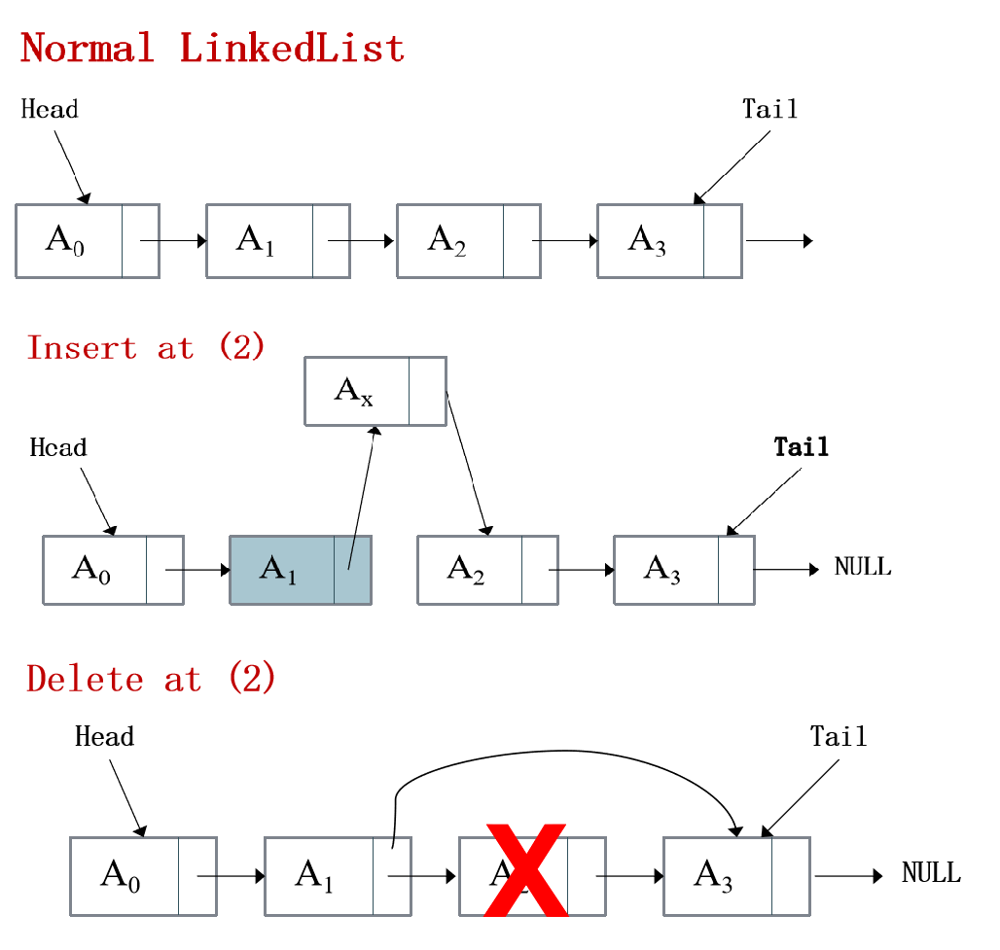
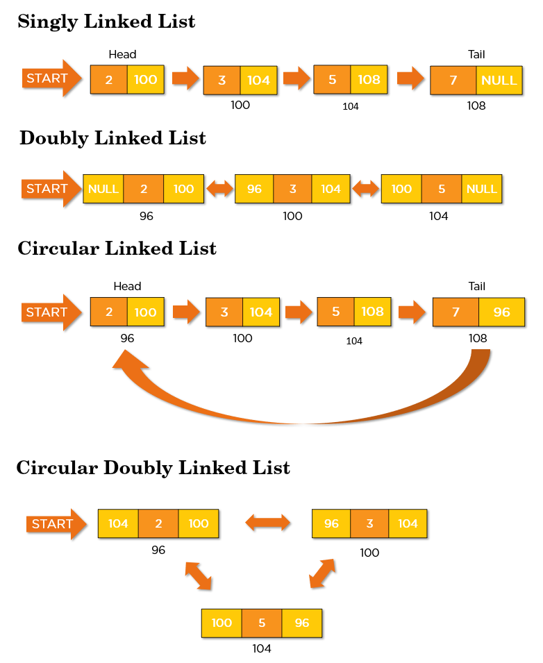
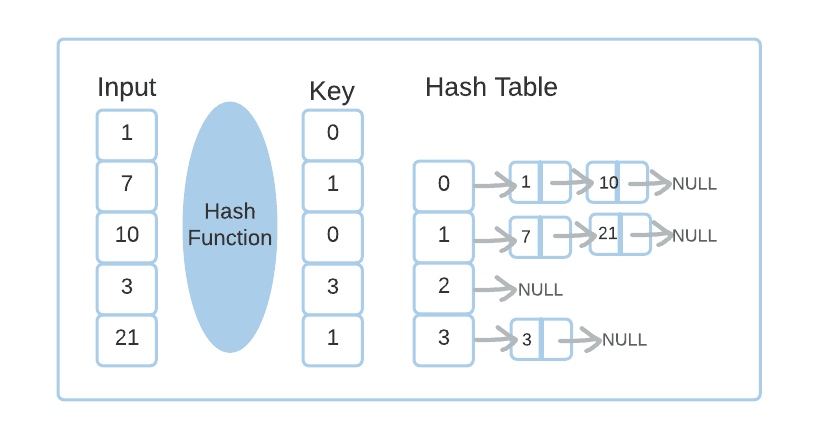

# Linked List

- It is a collection of nodes where each node contains data and a link to the next node. It forms a chain-like structure.

- As it is dynamic, an increase or decrease in size can be done as per need

- Unlike arrays, linked list elements are not stored at a contiguous location; the elements are linked using pointers.

- This approach is achieved by using:
    - `Node` class which stores data and a pointer to the next node.
    - `LinkedList` class which has pointers to the head and the tail of the collection.



## Types of Linked Lists

- **A singly linked list** is a unidirectional linked list. So, you can only traverse it in one direction, i.e., from head node to tail node.

- **A doubly linked list** is a bi-directional linked list. So, you can traverse it in both directions. Unlike singly linked lists, its nodes contain one extra pointer called the previous pointer which points to the previous node.

- **A circular Linked list** is a unidirectional linked list. So, you can traverse it in only one direction. But this type of linked list has its last node pointing to the head node. So while traversing, you need to be careful and stop traversing when you revisit the head node.

- **A circular doubly linked list** is a mixture of a doubly linked list and a circular linked list. Like the doubly linked list, it has an extra pointer called the previous pointer, and similar to the circular linked list, its last node points at the head node. This type of linked list is the bi-directional list. So, you can traverse it in both directions.



## Some Applications of LinkedList

- **Implementation of stacks and queues.**

- **Implementation of graphs : **Adjacency list** representation of graphs is most popular which is uses linked list to store adjacent vertices.**

- **Redo and undo functionality.**

- **Representation of sparse matrices which are comprised of mostly zeros.**

- **Manipulation of polynomials by storing two data fields, namely coefficient, and power. Thus, every node denotes a term of a polynomial.**

- **Linked allocation of files:**
    - A file of enormous size may not be stored in one place on a disk. Hence, there have to be some means to connect all the scattered pieces of the file together. The application of a linked list lets an effective file allocation procedure in which every block of a file includes a pointer to the file’s text block. The file blocks can be distributed anywhere in the disk space. 

- **Memory Management:** 
    - Memory management is one of the operating system's key features. It decides how to allocate and reclaim storage for processes running on the system. We can use a linked list to keep track of portions of memory available for allocation.

- **Hash Tables:** 
    - A hash table is a data structure where every value is mapped to a key using a hash function. But in some cases, the key for two or more values of the input is the same. In this case, we store all these values corresponding to the same key using a linked list. For example:
   
    


## Real World Applications of Linked List

- **Image viewer –** Next and Previous images are linked, so can be accessed by the “next” and “previous” buttons.

- **Next and Previous page in a web browser –** We can access the previous and next “url” searched in a web browser by pressing the “back” and “next” buttons as they are connected as a linked list.

- **Music Player –** Songs in the music player are connected to the previous and next song. You can listen to the songs either from the beginning or end of the list.

- **Switching between applications on the Computer –** Using alt+tab on linux or windows, you can swap between running applications. 

- **Undo Function In Photoshop and Word documents –** Every modification you make to a document or file is saved as nodes. We can return to the previous state of the document by pressing 'Ctrl+Z.'


## Time Complexity

| Function       | Description |
|----------------|-------------|
| `size()`       | O(1) |
| `empty()`      | O(1) |
| `front()`      | O(1) |
| `back()`       | O(1) |
| `at()`         | O(n) |
| `insert()`     | O(n) |
| `push_front()` | O(1) |
| `push_back()`  | O(1) |
| `pop_front()`  | O(1) |
| `pop_back()`   | O(n) |
| `deleteAt()`   | O(n) |
| `undo()`       | O(n) |


## Members

| Member   | Description |
|----------|-------------|
|`data`    | Stores data. |
|`next`    | Points to the next node. |
|`elements`| Holds the number of items in the list.|
|`head`    | Points to the first node. |
|`tail`    | Points to the last node. |


## Constructors & Destructor

| Constructor / Destructor | Description |
|--------------------------|-------------|
| `Node(value)`            | Stores the value of the node and set the next pointer to NULL. |
| `LinkedList(void)`       | Initially set head, tail pointers to NULL and the number of elements to 0. |
| `~LinkedList()`          | Deleting all nodes. |
 

## Functions

| Function       | Description |
|----------------|-------------|
| `size()`       | Returns the number of elements in the list. |
| `empty()`      | Returns whether the list is empty(1) or not(0). |
| `front()`      | Returns the value of the first element in the list.|
| `back()`       | Returns the value of the last element in the list.|
| `at(pos)`      | Returns the element at specified position.|
| `insert(pos,x)`| Inserts new elements in the list before the element at a specified position and increases size of the list by 1.|
| `push_front(x)`| Adds a new element ‘x’ at the beginning of the list, and increases size of the list by 1. |
| `push_back(x)` | Adds a new element ‘x’ at the end of the list, and increases size of the list by 1. |
| `pop_front()`  | Removes the first element of the list, and reduces size of the list by 1. |
| `pop_back()`   | Removes the last element of the list, and reduces size of the list by 1.|
|`deleteAt(pos)` | Remove an element at specific position, and reduces size of the list by 1.|
|`undo()`        | Reverses the last operation.|


## Example 

```cpp
#include "LinkedList.cpp"
#include <iostream>
using namespace std;

int main()
{

    LinkedList <int> list;

    list.push_back(10);
    list.push_back(20);
    list.push_back(40);

    list.insert(2,30);
    list.insert(4,50);


    for(int i = 0 ; i< list.size() ; i++)  // 10 20 30 40 50
        cout<<list.at(i)<< " ";

    cout<<endl;

    list.deleteAt(3);  // 10 20 30 50
    list.deleteAt(3);  // 10 20 30

    list.push_front(99);    //99 10 20 30

    cout << list.front()<< endl; //99
    cout << list.back()<< endl;  //30
    cout << list.at(1)<< endl;   //10

    list.pop_back();  // 99 10 20
    list.pop_front(); // 10 20

    cout << list.front()<< endl; //10
    cout << list.back()<< endl;  //20
    cout << list.at(1)<< endl;   //20

    list.undo(); // 99 10 20
    list.undo(); // 99 10 20 30
    list.undo(); // 10 20 30

    for(int i = 0 ; i< list.size() ; i++)  // 10 20 30
        cout<<list.at(i)<< " ";


    return 0;
}

```
