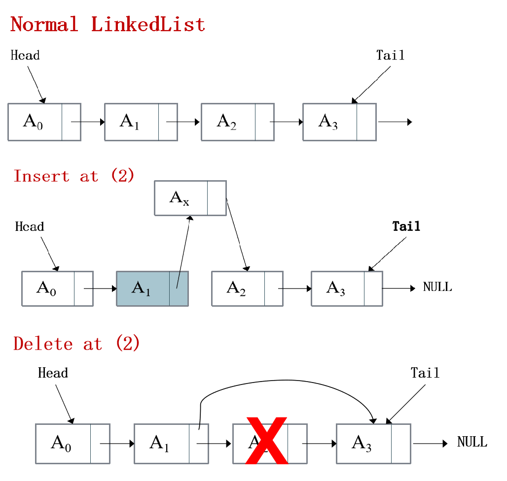

# LinkedList

- It is a collection of nodes where each node contains data and a link to the next node.

- Unlike arrays, linked list elements are not stored at a contiguous location; the elements are linked using pointers.



# The functions associated with ArrayList are:

|Function|Description|
|--|--|
|**size()**|Returns the number of elements in the list.|
|**empty()**| Returns whether the list is empty(1) or not(0).|
|**front()**|	Returns the value of the first element in the list.|
|**back()**|	Returns the value of the last element in the list.|
|**at(pos)**|Returns the element at specified position.|
|**insert(pos,x)**|	Inserts new elements in the list before the element at a specified position.|
|**push_front(x)**|	Adds a new element ‘x’ at the beginning of the list.|
|**push_back(x)**| 	Adds a new element ‘x’ at the end of the list.|
|**pop_front()**|	Removes the first element of the list, and reduces size of the list by 1.|
|**pop_back()**|	Removes the last element of the list, and reduces size of the list by 1.|
|**deleteAt(pos)**| Remove an element at specific position.|
|**undo()**|Reverses the last operation.|

----------------------------------

# Example 

```cpp
#include "LinkedList.cpp"
#include <iostream>
using namespace std;

int main()
{

    LinkedList <int> list;

    list.push_back(10);
    list.push_back(20);
    list.push_back(40);

    list.insert(2,30);
    list.insert(4,50);


    for(int i = 0 ; i< list.size() ; i++)  // 10 20 30 40 50
        cout<<list.at(i)<< " ";

    cout<<endl;

    list.deleteAt(3);  // 10 20 30 50
    list.deleteAt(3);  // 10 20 30

    list.push_front(99);    //99 10 20 30

    cout << list.front()<< endl; //99
    cout << list.back()<< endl;  //30
    cout << list.at(1)<< endl;   //10

    list.pop_back();  // 99 10 20
    list.pop_front(); // 10 20

    cout << list.front()<< endl; //10
    cout << list.back()<< endl;  //20
    cout << list.at(1)<< endl;   //20

    list.undo(); // 99 10 20
    list.undo(); // 99 10 20 30
    list.undo(); // 10 20 30

    for(int i = 0 ; i< list.size() ; i++)  // 10 20 30
        cout<<list.at(i)<< " ";


    return 0;
}

```
