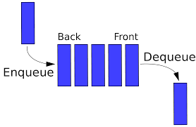
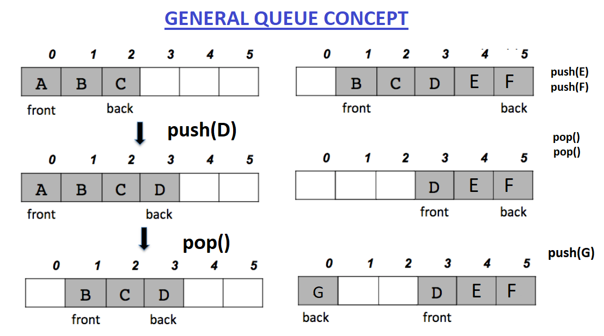

# Queue Data Structure implementation using Array - C++

Queues are a type of containers that operate in a first in first out (FIFO) type of arrangement. Elements are inserted at the back (end) and are deleted from the front.





# The functions associated with queue are:

- **empty()** – Returns whether the queue is empty.
- **size()** – Returns the size of the queue.
- **front()** – Returns the first element of the queue.
- **back()** – Returns the last element of the queue.
- **push(x)** – Adds the element 'x' at the end of the queue.
- **pop()** – Deletes the first element of the queue.

# Example 

```cpp
#include <iostream>
#include "Queue.cpp"
using namespace std;

int main()
{

    Queue <int> q;

    q.push(10);  // queue: 10
    q.push(20); //  queue: 10 , 20

    cout<< q.front() << ' ' << q.back()<< endl; //output: 10 20
    cout << q.size() << endl; // print the size of queue -> 2 at this moment

    q.push(30); //queue: 10 , 20 , 30
    q.push(40); //queue: 10 , 20 , 30 , 40
    q.pop(); // delete the first element in the queue -> 10 at this moment

    cout<< q.front() << ' ' << q.back()<< endl; //output: 20 40
    cout << q.size() << endl; // print the size of queue -> 3 at this moment


    while(q.size() != 0) //loop until container is empty
    {
        cout << q.front() << endl;
        q.pop();
    }

    // the output of the previous loop is : 20 30 40
    
}

```

# Note
In the **main.cpp**, I implemented a task organizer application such that each task has a name and ID using first in first out property of the queue.
