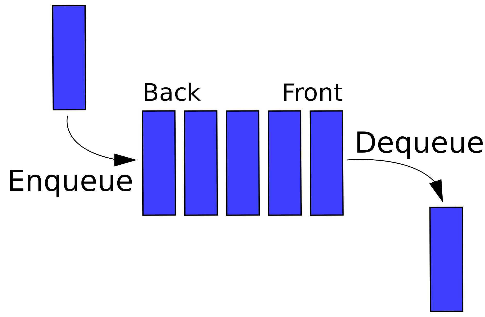

# Queue Implementaion using a Dynamic Array


- Queues are a type of containers that operate in a first in first out (FIFO) type of arrangement. Elements are inserted at the back (end) and are deleted from the front.



- This approach is achieved by using **Circular array:**

    - It's quite similar to the normal array the only difference is in a circular array the index after the last element is that of the first element.

    - Whenever we increase index in a circular array, we take modulo with the capacity of the array to proceed to the next element: 
        - `Back = (Back + 1) % capacity` 
        - `Front = (Front + 1) % capacity`

    - The default value for front and back is `-1`, denoting that the queue is empty.

    - When we add one element,the `front` and the `back` of the queue points at the first index of the array. As we add elements to the queue,the tail keeps on moving ahead, while the head remains at the first index.

    - When we remove element we move the `front` to the next position.


## Some Applications of Queue

- **Spooling in printers.**

- **Maintaining the playlist in media players.**

- **Call center phone systems use queues to hold the calls until they are answered by the service representatives.**

- **Managing requests on a single shared resource such as CPU scheduling and disk scheduling. Here we have multiple tasks requiring CPU or disk at the same time. The CPU or disk time is scheduled for each task using a queue.**

- **Computer systems must often provide a “holding area” for messages between two internal processes or programs, or between two systems over a network. This holding area is usually called a “buffer” and is often implemented as a queue, because we want the message time order to be retained.**

- **Handling hardware or real-time systems interrupts. The interrupts are handled in the order they arrive i.e First come first served.**


## Time Complexity

| Function  | Description |
|-----------|------|
| `empty()` | O(1) |
| `size()`  | O(1) |
| `full()`  | O(1) |
| `front()` | O(1) |
| `back()`  | O(1) |
| `push(x)` | O(n) |
| `expand()`| O(n) |
| `pop()`   | O(1) |

## Members

| Member   | Description |
|----------|-------------|
|`arr`     | Generic container to store data.|
|`capacity`| Holds the array size and Increases the size of new array by twice when the array gets full.|
|`elements`| Holds the number of items in the array.|
|`Front`   | Points to the first element of the queue. |
|`Back`    | Points to the last element of the queue. |


## Constructors & Destructor

| Constructor / Destructor | Description |
|--------------------------|-------------|
| `Queue()`                | Allocates the memory for an array of size 10.|
| `Queue(capacity)`        | Allocates the memory for an array of size selected by the user.|
| `~Queue()`               | Release memory using by the array before the class instance is destroyed.|
 

## Private Functions

| Function | Description |
|----------|-------------|
|`expand()`| Doubles the queue by twice and copy the previous elements to a new array.|


## Public Functions

| Function | Description |
|----------|-------------|
| `size()` | Returns the size of the queue. |
| `empty()`| Returns whether the queue is empty. |
| `full()` | Returns whether the queue is full.|
|`front()` | Returns the first element of the queue.|
|`back()`  | Returns the last element of the queue.|
|`push(x)` | Adds the element 'x' at the end of the queue.|
|`pop()`   | Deletes the first element of the queue.|


# Example 

```cpp
#include <iostream>
#include "Queue.cpp"
using namespace std;

int main()
{

    Queue <int> q;

    q.push(10);  // queue: 10
    q.push(20); //  queue: 10 , 20

    cout<< q.front() << ' ' << q.back()<< endl; //output: 10 20
    cout << q.size() << endl; // print the size of queue -> 2 at this moment

    q.push(30); //queue: 10 , 20 , 30
    q.push(40); //queue: 10 , 20 , 30 , 40
    q.pop(); // delete the first element in the queue -> 10 at this moment

    cout<< q.front() << ' ' << q.back()<< endl; //output: 20 40
    cout << q.size() << endl; // print the size of queue -> 3 at this moment


    while(q.size() != 0) //loop until container is empty
    {
        cout << q.front() << endl;
        q.pop();
    }

    // the output of the previous loop is : 20 30 40
    
}

```