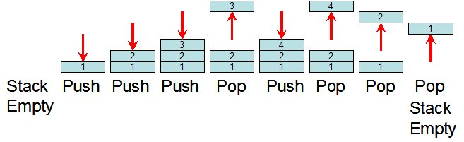

# Stack of Integers Implementation in C++

A stack is a list with the restriction that insertions and deletions can be performed in only one position, the end of the list (LIFO).



## The functions associated with stack are: 

- **empty()** – Returns whether the stack is empty. 
- **size()** – Returns the size of the stack.
- **top()** – Returns the top most element of the stack.
- **push(x)** – Adds the element ‘x’ at the top of the stack.
- **pop()** – Deletes the top most element of the stack.

# Example

```cpp
#include <iostream>
#include "Stack.h"
using namespace std;
int main() {

    Stack stack;

    stack.push(10); // insert an element with value 10 to the top of the stack
    stack.push(20); // insert an element with value 20 to the top of the stack

    cout << stack.top() << endl; // print the top of stack -> 20 at this moment

    stack.push(30); // insert an element with value 30 to the top of the stack

    cout << stack.top() << endl; // print the top of stack -> 30 at this moment
    
    cout << stack.size() << endl; // print the size of stack -> 3 at this moment

    stack.pop(); // delete the last element in the stack -> 30 at this moment

    while (!stack.empty())
    {
        // print the top of the stack and delete it
        cout <<stack.top()<< endl;
        stack.pop();
    }

    // the output of the previous loop is : 10

}
```

### Note  

In the **main.cpp**, I implemented a function that takes input parameters (decimal number) and works on it using Stack to convert it into a binary number.
