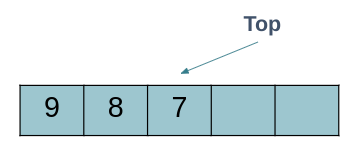

# Stack

A stack is a list with the restriction that insertions and deletions can be performed in only one position, the end of the list (LIFO).


# Stack Implementations

### Using Dynamic Arrays




### Using Linked Lists


# Some Applications of a Stack

- Undo operations.

- Evaluating expressions consisting of operands and operators, e.g, 5 * ( 6 + 2 ) - 12 / 4.

- Backtracking, i.e., to check parenthesis matching in an expression:
    - you have to find if the parenthesis is either correctly matched or not:
         - `a + b * [c + d )` is not a valid
         - `( a + b ) * ( c + d )` is valid
         
-  Conversion from one form of expression to another, e.g, infix to postfix.

- Stacks can be used for Memory Management :
  - The size of the memory to be allocated is known to the compiler. When a function is called, its variables get memory allocated on the stack. When the function call is completed, the memory for the variables is released. All this happens with the help of some predefined routines in the compiler. The user does not have to worry about memory allocation and release of stack variables.


# Example

```cpp
#include <iostream>
#include "Stack.h"
using namespace std;
int main() {

    Stack stack;

    stack.push(10); // insert an element with value 10 to the top of the stack
    stack.push(20); // insert an element with value 20 to the top of the stack

    cout << stack.top() << endl; // print the top of stack -> 20 at this moment

    stack.push(30); // insert an element with value 30 to the top of the stack

    cout << stack.top() << endl; // print the top of stack -> 30 at this moment
    
    cout << stack.size() << endl; // print the size of stack -> 3 at this moment

    stack.pop(); // delete the last element in the stack -> 30 at this moment

    while (!stack.empty())
    {
        // print the top of the stack and delete it
        cout <<stack.top()<< endl;
        stack.pop();
    }

    // the output of the previous loop is : 10

}
```
