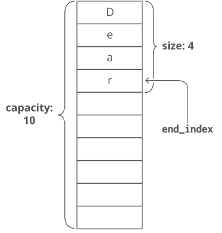

## Stack Implementaion using a Dynamic Array

Dynamic array overcomes overflow error when the array gets full. This approach is achieved by starting with a default array size and when the array gets full, we dynamically take a new array of bigger size and copy the previous elements to the new array.

## Time complexity

| Function  | Description |
|-----------|------|
| `size()`  | O(1) |
| `empty()` | O(1) |
| `top()`   | O(1) |
| `expand()`| O(n) |
| `push(x)` | O(n) |
| `pop()`   | O(1) |

## Members

| Member   | Description |
|----------|-------------|
|`arr`     | Generic container to store data.|
|`capacity`| Holds the array size and Increases the size of new array by twice when the array gets full.|
|`elements`| Holds the number of items in the array.|

## Constructors & Destructor

| Constructor / Destructor | Description |
|--------------------------|-------------|
| `Stack(void)`            | Allocates the memory for an array of size 10.|
| `Stack(capacity)`        | Allocates the memory for an array of size selected by the user.|
| `~Stack(void)`           | Release memory using by the array before the class instance is destroyed.|
 

## Private Functions

| Function | Description |
|----------|-------------|
|`expand()`| Doubles the stack by twice and copy the previous elements to a new array.|

 
## Public Functions

| Function | Description |
|----------|-------------|
| `size()` | Returns the size of the stack. |
| `empty()`| Returns whether the stack is empty. |
| `top()`  | Returns the top most element of the stack.|
| `push(x)`| Adds the element ‘x’ at the top of the stack.|
| `pop()`  | Deletes the top most element of the stack.|